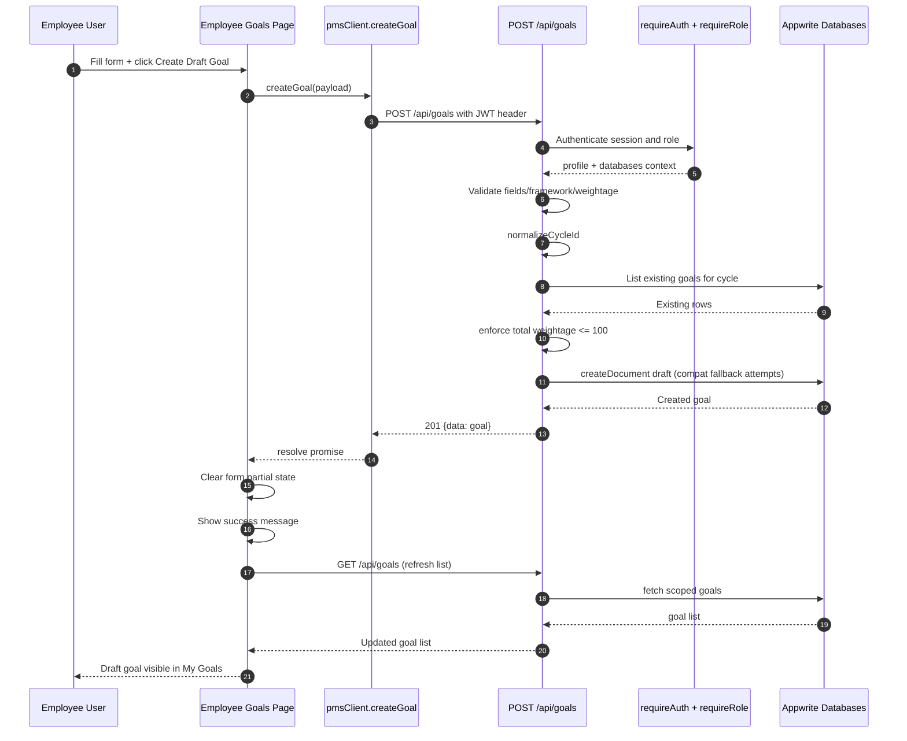
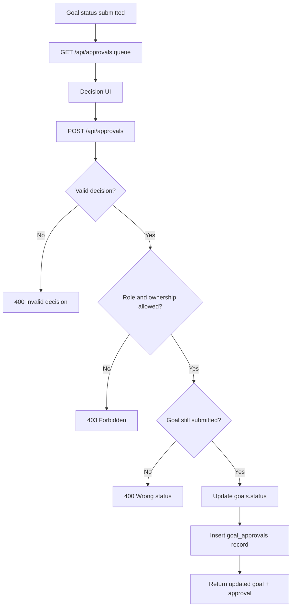
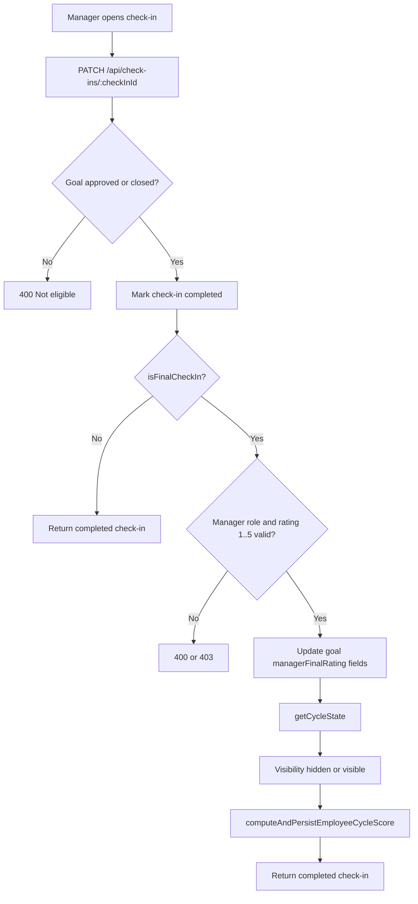
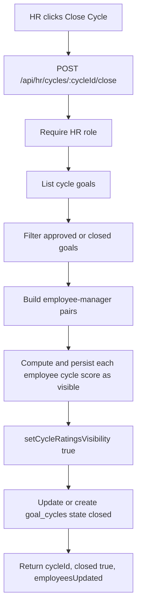
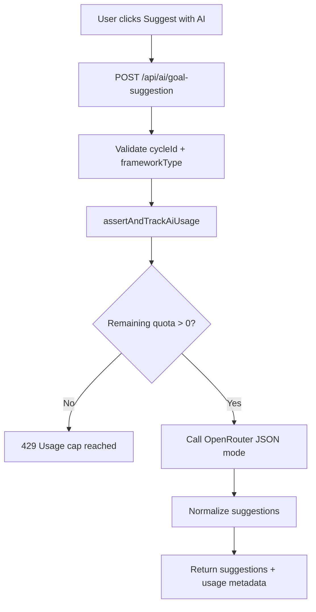
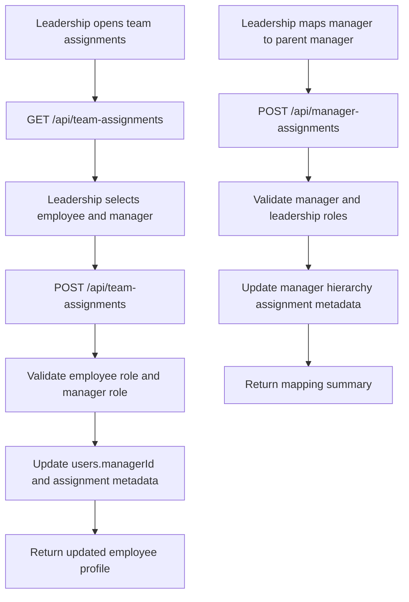

# HR Console - Flow Diagrams (Mermaid)

Use these diagrams for architecture reviews, onboarding, and demos.

## 1. Authentication and Role Routing Flow

```mermaid
flowchart TD
    A[User opens route] --> B{Protected route?}
    B -- No --> C[Render public page]
    B -- Yes --> D{Has Appwrite session cookie?}
    D -- No --> E[Redirect to /login]
    D -- Yes --> F[Middleware calls /api/auth/redirect]
    F --> G{redirectTo returned?}
    G -- No --> E
    G -- Yes --> H{Current path matches redirectTo?}
    H -- Yes --> I[Allow request]
    H -- No --> J[Redirect to role route]

    K[Login page] --> L[loginWithGoogle]
    L --> M[Appwrite OAuth]
    M --> N[/auth/callback with userId + secret]
    N --> O[/api/auth/session]
    O --> P[Set appwrite_session cookies]
    P --> Q[/api/auth/redirect]
    Q --> R{role exists?}
    R -- No --> S[/onboarding]
    R -- Yes --> T[/employee or /manager or /hr]
```

## 2. Create Goal End-to-End Flow



## 3. Goal Approval Flow (Manager or HR)



## 4. Check-in Completion and Final Rating Flow



## 5. HR Cycle Close Flow



## 6. AI Goal Suggestion Flow with Usage Cap



## 7. Team Assignment Governance Flow


